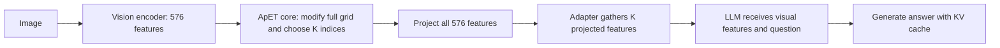

# Code reading plan — October 10, 2026

Based on the local `apet-analysis` checkout at `ade1fd4`, yesterday's
[session note](2026-10-09-kaggle-apet.md), and the
[project proposal](../reports/Peng_Chen_CSE590_ApET_Project_Proposal_v2.pdf).
GitHub pages were unavailable through the web reader; this guide uses the local
source. This is a study plan, with no changes to experiment or compression code.

## Today's objective

Be able to explain how one MMStar image and question become a prediction, where
ApET changes the visual representation, and which functions need instrumentation
for the proposal's research questions. Concentrate on the current LLaVA input
stage before extending the model or environment.

The proposal's priorities are:

1. Relate reconstruction error to question-specific answer contribution, across
   task types and selected model layers.
2. Separate selection effects from merging effects, including merge-target rules.
3. Use the evidence to explore adaptive token budgets; PCA/SVD is secondary.

Yesterday established infrastructure and a limited input-stage reproduction.
Question-specific interventions, merge ablations, full diagnostic traces, GQA
same-image/different-question examples, and layer analysis remain future work.

## Architecture to keep in mind

| Part | Responsibility | Main files |
|---|---|---|
| Environment | Select and reproduce the Linux Python/package stack | `pyproject.toml`, `uv.lock`, `bootstrap/setup_linux.sh` |
| Compression core | Tensor math independent of a particular model | `apet_compression/core.py` |
| Model adapter | Integrate compression with HF LLaVA's features, placeholders, and generation | `apet_compression/adapters/hf_llava.py` |
| Experiment runners | Load samples, call inference, score or benchmark, save provenance | `scripts/eval_mmstar.py`, `scripts/llava_runtime.py`, `scripts/benchmark_apet.py` |
| Validation/reference | Compare with original source and protect integration behavior | `apet_compression/legacy_reference.py`, `research/tests/test_apet_extraction.py` |

For a single generation, the adapter first shortens the image-placeholder block
and its attention mask to K entries. During the model's vision forward pass:

The image-placeholder count must equal the supplied visual-feature count.
Only the initial vision/prefill pass applies image compression; cached decode
reuses the prepared representation. Vision encoding and full-grid projection
still run, and model weights are unchanged.

## Suggested reading order

### 1. Re-establish the research goal — 15 minutes

Read proposal pages 1–3, especially the research questions, selection/merging
controls, and answer preservation rate. Skim yesterday's note for the measured
results. In the [ApET paper](../reports/0_Ma_ApET_Approximation-Error_Guided_Token_Compression_for_Efficient_VLMs_CVPR_2026_paper.pdf),
start with Sections 3.1 and 3.3 and Figure 3. Return to the theoretical argument
in Section 3.2 after understanding the computation.

Keep this distinction in your notes: reconstruction error describes how well
other visual features approximate a token; your project asks whether that token
matters to a particular answer. The core receives no question or answer.
At the input stage the visual features are question-independent. At a decoder
layer, features can already be influenced by the question, even if the same
compression function still receives only a feature tensor.

### 2. Follow one request — 25–35 minutes

Read [`eval_mmstar.py`](../../scripts/eval_mmstar.py), starting with `run()`.
Initially focus on dataset selection, `CompressionConfig`, the adapter context,
the warmup, and the call to `generate_answer()`.

Then read [`llava_runtime.py`](../../scripts/llava_runtime.py):

- `load_llava()`: pinned HF checkpoint, FP16, SDPA, GPU placement, processor setup.
- `generate_answer()`: image/question processing, 576 image placeholders,
  `adapter.prepare_inputs()`, `model.generate()`, timing, and decoding.
- `generation_options()`: ordinary accuracy runs allow early EOS; the timing
  benchmark supplies a minimum output length.

Write down what is CPU preprocessing, what executes inside the measured
generation interval, and what is saved in JSONL. Treat the full HF model as a
library call during this first pass.

### 3. Study the algorithm — 45–60 minutes

Read [`core.py`](../../apet_compression/core.py) in this order:

1. `CompressionConfig`: K retained tokens, M basis tokens, epsilon, merging.
2. `CompressionResult`: modified full grid, selected indices/mask, basis
   locations, replacement slots, and per-token errors.
3. `compress_tokens()`: walk through the main stages, then inspect its helpers.
4. `fps()`: select a basis that covers the feature space, using a seeded first token.
5. `_merge()`: choose cosine-similarity destinations and average discarded features
   into them.

Use N=576, M=10, and K=288 or 96. K and M are different budgets; in the legacy
functions the variable `k` often means the basis count.

Annotate these shapes, where b is batch size and D is the vision feature dimension:

| Variable | Shape | Meaning |
|---|---|---|
| `features` / `values` | `[b, N, D]` | Original visual features |
| `basis_indices` | `[b, M]` | Original FPS source locations |
| `basis` | `[b, M, D]` | Features used to reconstruct the others |
| `gram` | `[b, M, M]` | Basis Gram matrix, with diagonal regularization |
| `rhs` | `[b, M, N]` | Right-hand side of the linear system |
| `coefficients` | `[b, N, M]` | Reconstruction weights per token |
| `reconstructed` | `[b, N, D]` | Approximated features |
| `errors` | `[b, N]` | Reconstruction-error norms |
| `error_indices` | `[b, K]` | Error-ranked selected slots |
| `basis_slots` | `[b, M]` | Output slots receiving basis features |
| `kept_indices` | `[b, K]` | Selected slots sorted into spatial order |

The code solves a regularized linear system in FP32, then uses FP16 for the
legacy-compatible basis placement and merging. It retains the difficult-to-
reconstruct information and basis features. Understand why retaining high-error
tokens differs from simply keeping the most redundant tokens.

Pay particular attention to two details:

- `basis_indices` and `basis_slots` are different. The last M error-top-K slots,
  sorted spatially, receive basis vectors. A retained output slot may therefore
  represent another original patch.
- `_merge()` targets the K-M non-basis selected features. Those high-error
  features can be modified by merging; basis replacement slots are excluded
  from the destination set. This matters directly to the proposal's
  importance-protected merge control.

Useful Torch operations to learn here: `gather`, `scatter_`, `scatter_add_`,
`unsqueeze`, `expand`, boolean indexing, batched `@`, `transpose`, `topk`, and
`torch.linalg.solve`. Learn each through its role and tensor shape.
Basis sampling and retained-token ranking are separate choices: changing the
FPS seed or choosing random basis vectors does not create the proposal's
random retained-token selection baseline.

### 4. Understand the integration boundary — 25–35 minutes

Read [`hf_llava.py`](../../apet_compression/adapters/hf_llava.py):

- `__enter__()` / `__exit__()`: register and remove hooks on one model instance.
  The `with` block is analogous to Java's resource-management pattern.
- `prepare_inputs()`: shorten placeholders and attention masks, and set the
  per-image compression seed.
- `_before_projection()`: compress vision features and run one-time legacy parity.
- `_after_projection()`: gather K projected features in spatial order.
- `statistics()`: export the diagnostic record.

Be able to explain why the core does not import Transformers, while the adapter
needs knowledge of this model/version. Also explain why installed model code
does not need to be edited. The adapter is currently restricted to Transformers
4.48.2, one image, batch size one, and the default CLIP feature selection.

### 5. Compare with the original and read the checks — 20–30 minutes

Read only the relevant original functions first:

- [`llava/model/llava_arch.py`](../../llava/model/llava_arch.py): `encode_images()`
  and `token_merging()`.
- [`llava/model/utils.py`](../../llava/model/utils.py): `fps()`.

Then read [`legacy_reference.py`](../../apet_compression/legacy_reference.py)
and [`test_apet_extraction.py`](../tests/test_apet_extraction.py). The reference
executes extracted original function bodies without importing the whole legacy
LLaVA package. Follow the checks for matching FPS, exact masks, numerical feature
agreement, unchanged inputs, identity behavior, cached generation, and hook cleanup.

The tests protect the reproduction path. Intentional variants need their own
controls and validation: `verify_result()` deliberately requires the legacy
merge rule and epsilon. Older `smoke_apet_core.py` / `smoke_apet_behavior.py`
scripts predate this extracted architecture and import legacy model code.

### 6. Read evaluation through the proposal — 20 minutes

Return to `parse_answer()` and `summarize()` in `eval_mmstar.py`, then read
[`compare_mmstar.py`](../../scripts/compare_mmstar.py). Identify how matching
samples, checkpoint, package versions, and protocol are enforced. Notice why
strict parsing can mark an option-prefixed explanation as incorrect.

The proposal defines:

`APR(K) = baseline-correct samples still correct after compression / baseline-correct samples`.

From yesterday's recorded counts:

| K | Baseline-correct | Lost correct | Preserved correct | APR |
|---|---:|---:|---:|---:|
| 288 | 509 | 46 | 463 | 90.96% |
| 96 | 509 | 66 | 443 | 87.03% |

APR differs from overall accuracy or the compressed/baseline accuracy ratio:
newly gained correct answers can offset losses in overall accuracy. An explicit
APR field is a useful next evaluation addition; it is not currently reported.

If time remains, read `trial_plan()`, `run()`, and `summarize_trials()` in
[`benchmark_apet.py`](../../scripts/benchmark_apet.py). Focus on fixed output
lengths, warmup exclusion, paired conditions, order rotation, and what the
generation timer includes. These explain the larger benefit for short answers
than for forced 128-token outputs.

## Research work this reading prepares

| Proposal question | Study now | Missing capability to add later |
|---|---|---|
| Error versus answer contribution | Core `errors`, adapter pre-hook, inference outputs | Full per-token traces and a clearly defined question-specific intervention proxy |
| Selection versus merging | `error_indices`, basis placement, `_merge()` | Controlled merge/no-merge runs, random targets, protected targets, and merge-assignment logging |
| Adaptive budgets | Error distribution and fixed-budget results | Error statistics and a policy choosing K; evaluation against matched average-budget baselines |
| Task and layer dependence | Category scoring and input-stage representation | GQA question groups, TextVQA subset, selected decoder-layer instrumentation |

Current diagnostics save selected/basis indices and the mean reconstruction
error. They do not export every token error or discarded-token merge assignment.
`CompressionResult.errors` contains the full errors, and `_merge()` computes
nearest destinations and counts internally; those are useful instrumentation
points. Keep detailed tracing optional so it does not silently alter benchmark
overhead.

For GQA same-image/different-question controls, reuse the same input-stage
features and compression seed across questions about an image. Today's
`seed + sample index` rule should become an image-based seed for that experiment;
different question IDs must not silently produce different FPS selections.

`merge=False` exists in the core, but the evaluator currently enables merging
and the parity helper requires it. The flag skips merging while preserving
basis replacement. It does not by itself define every selection-only baseline.
Plan variant wiring and compare the same selected slots and FPS seeds when
isolating merge effects.

Later, inspect `layer_prune()` in
[`llava/model/modeling_llama_x.py`](../../llava/model/modeling_llama_x.py) and
its call in the decoder loop. This is where the original implementation handles
intermediate-layer compression, positions, masks, and visual-token spans. It
is reference material for the proposal's layer analysis; it is not used by the
current HF input-stage adapter. Porting it is a separate integration task.

Qwen, Video-LLaVA, installer internals, and optional basis alternatives can wait
until they serve a specific experiment. The proposal's primary model remains
LLaVA-1.5-7B, with MMStar for broad evaluation, GQA for controlled question
analysis, and TextVQA for fine-detail/OCR cases.

## A concrete deliverable for today

Write a short explanation of one request and annotate the tensor shapes above.
Then answer:

1. Which input-stage computations receive the question? Which do not?
2. Why can a high reconstruction error coexist with little contribution to an answer?
3. How does a retained output feature differ from an untouched original patch?
4. Which retained features can merging alter, and which are protected?
5. Where would full errors, merge assignments, and intervention measurements be recorded?
6. Why do the current accuracy and timing results leave the proposal's main
   mechanism questions open?
7. How would you keep the compressed image representation fixed while changing
   the question?

For a small CPU exercise on Kaggle, construct `[1, 576, 64]` random features,
seed a private generator, and call the extracted core with K=288, M=10. Inspect
the result shapes and repeat with `merge=False`, creating/resetting the generator
to the same seed for each call.
Selection/error indices should match while merged features can change. This
requires the project PyTorch environment but no model weights or GPU. The
unmodified parity tests remain the regression check for the legacy path.

Completing the reading and explanation is sufficient for today. The next small
implementation should be an explicit APR metric and optional diagnostic tracing
before costly token-intervention experiments or an adaptive policy.
